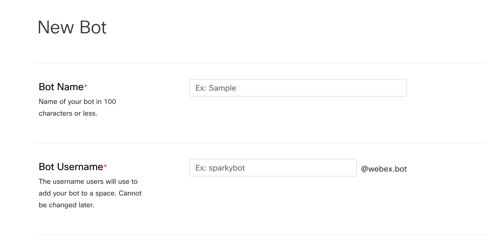
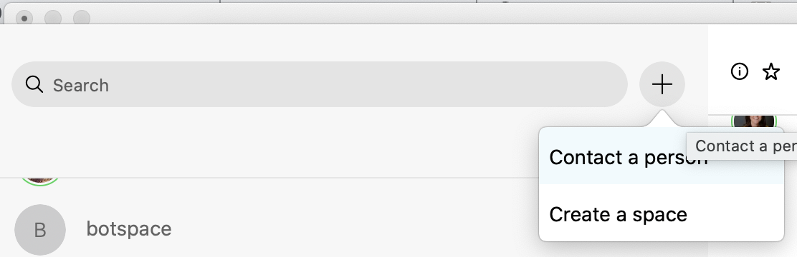
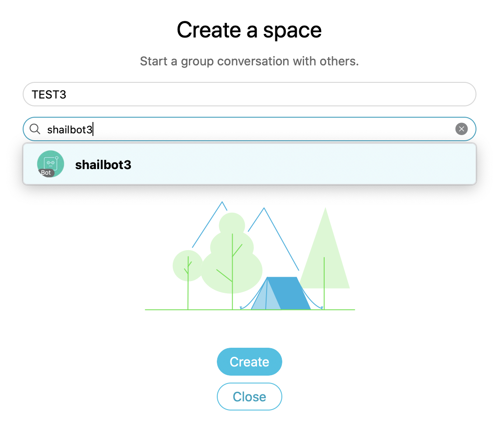

# Building Webex bots with Python

A Webex bot is like a user, a bot has access to the room or space its in 
and can interact with direct messages to it. To start working with a bot
it needs to be created first.

You can create a new webex bot by going to [Cisco Devnet](https://developer.webex.com/my-apps) and logging in with a Cisco account.

From there press create "new app" & select "bot".

You should see a screen similar to this:



You can give your bot name and a username. The username must be unique and should be something you can remember since it'll be used to add your bot to a Webex space later. You can also choose an image for your bot and a description on this page. 

After creating a bot you should be brought to a screen with an access token and the bots ID. Make sure to copy down the access token and the ID somewhere! These act as the username and password for you bot when working with the Webex API.

## Adding your bot

Now that the bot is created, it can be added to a Webex space. This can be done by creating a new space by pressing the "plus" button on the top left corner of Webex, near the search bar and searching for your bot by the username you gave it.
<p align="center">

</p>

You can name the space whatever, and if Webex has successfully created your bot it should appear with a direct search on any Webex client with any Webex account.

<p align="center">

</p>


You now should have a space where you can test your bot, and although you can send messages you're bot won't actually be able to do anything because it doesn't have any brains yet - we'll have to program its functionality ourselves.

## Webhooks & APIs

We'll be writing a python script that'll act as a server - a program that will always be running. Whenever our bot needs to do something our script will handle the logic while Webex will act as a middleman routing messages back and forth. 

There are two ways to add functionality, the first is through an API call. This is when your script sends a request out somewhere. The second is a Webhook this when a request is sent to your script.

## JSON Payloads

We'll be working with a library called "requests" to send internet requests and "sockets" for handling incoming requests. Webex uses a RESTFul API design which typically sends data encoded in JSON. Python is works specifically well with Python because it has a datastructure that can easily be converted to JSON called the dictionary *(also sometimes called a map)*

A dictionary associates keys with values. For example imagine we had two types of emails, work emails and personal emails. We could store them in two separate lists but it would be harder to keep track of, it would be difficult to tell which is which if we ever sent the data over the internet also. We can represent this with a dictionary like this:

*example of information that could be sent over*

```python
my_obj = {
	"work_emails" : ["foo@foo.foo", "b.b.b", "eg.eg"],
	"personal_emails" : ["example", "example"],
	"phone" : "1234567"
	"age" : 30
}
```

Notice that the keys are always strings, but the values can be any time of variable, even other dictionaries.

In python this will create a json object, if we wanted to access in individual field we would use indexing, but instead of using a numeric position we use the name of the key.

```python
my_obj["work_emails"] #will return the list of emails defined above
my_obj["age"] #will return the number 30
```

A key reason why JSON is used is because we can send data in convenient ways since any primitive type can be encoded as JSON and we can also send the meaning of each piece of data which helps the developer know what was sent along.


** Working with JSON in python **

You can convert a string to a JSON object with the library json

```python
import json

my_obj_str = "{ 'my_name' : 'shail', 'my_phone' : 123456789 }"
my_obj = json.loads( my_obj_str ) #i'm now a python dictionary!

string = json.dumps(my_obj) #i'm back to a string!

for key in my_obj:
	print( key , "--->", my_obj[key]) #lets print out the contents of the dictionary

```

## First API request

We can create a simple request to learn information about our bot

```python
import requests

MY_KEY = "your key here, and don't share it!"

response = requests.get( "https://api.ciscospark.com/v1/people/me", 
						  headers={"Authorization" : "Bearer " + MY_KEY } )

print( response )

if ( response.status_code == 200):
	data = response.json()

	for key in data:
		print(key, '-->', data[key])
else:
	print("Something went wrong!")
	print( response.text )

```

*Note: If you get an error saying requests library not found you will have to install through the python package manager (PIP) with the command:*
```
pip3 install requests --user
```

## ngrok 

Our bot can use any of the APIs listed on the reference page (assuming it has the right permissions). However we can't interact with our bot through webex yet. This requires a webhook. A webhook is an event that fires when something specific happens on Webex, like someone messaging your bot or a new user gets added.

Webhooks work by having Webex listen for specific events and then sending an HTTP request to a target URL. However, that URL must be accessible on the public internet, since most computers use private IPs we'll use the program ngrok to create a tunnel between our private IP and our public IP. This will act just like port forwarding on a router except our temporary public IP will forward everything to our localhost interface on our device.

You can download [ngrok here](https://ngrok.com/download) without signing up which will give you 12 hours of a public IP at a time, signing up for a free account will allow you more time. On Linux and Mac you can copy the binary file you downloaded and execute it to start. 

```
shailpa@SHAILPA-M-939W webex % ./ngrok 
NAME:
   ngrok - tunnel local ports to public URLs and inspect traffic

DESCRIPTION:
    ngrok exposes local networked services behinds NATs and firewalls to the
    public internet over a secure tunnel. Share local websites, build/test
    webhook consumers and self-host personal services.
    Detailed help for each command is available with 'ngrok help <command>'.
    Open http://localhost:4040 for ngrok's web interface to inspect traffic.

EXAMPLES:
    ngrok http 80                    # secure public URL for port 80 web server
    ngrok http -subdomain=baz 8080   # port 8080 available at baz.ngrok.io
    ngrok http foo.dev:80            # tunnel to host:port instead of localhost
    ngrok http https://localhost     # expose a local https server
    ngrok tcp 22                     # tunnel arbitrary TCP traffic to port 22
    ngrok tls -hostname=foo.com 443  # TLS traffic for foo.com to port 443
    ngrok start foo bar baz          # start tunnels from the configuration file
```

Which should give you a usage prompt. To start forwarding we just need to specify the protocol and the port number E.g:

```
ngrok http 3000
```

Which will result in:

```
ngrok by @inconshreveable                                                                         (Ctrl+C to quit)
                                                                                                                  
Session Status                online                                                                              
Session Expires               7 hours, 55 minutes                                                                 
Version                       2.3.35                                                                              
Region                        United States (us)                                                                  
Web Interface                 http://127.0.0.1:4040                                                               
Forwarding                    http://0d52ccd9.ngrok.io -> http://localhost:3000                                   
Forwarding                    https://0d52ccd9.ngrok.io -> http://localhost:3000                                  
                                                                                                                  
Connections                   ttl     opn     rt1     rt5     p50     p90                                         
                              0       0       0.00    0.00    0.00    0.00    
```


## Webhooks

Lets create a small script first to build a webhook for a but, theres an API request for that as well.

```python
import requests

MY_KEY = "Your key here!"


name = input ( "Enter a name\n" )
targetURL = input( "Enter a url\n" )

resource = "messages"
event = "all"

response = requests.post( "https://api.ciscospark.com/v1/webhooks" , headers={"Authorization" : "Bearer " + MY_KEY},
                           data={"name" : name, "targetUrl" : targetURL, "resource" : resource, "event" : event} )


if response.status_code != 200:
    print("Something went wrong!")
    print(response.text)
else:
    print( response.json() )

```

The above code will ask for a name and a target url and create a post request 
to Webex. The resource and events are hardcoded for now but could be change to listen
for specific events.

If we were to send our bot a direct message now our Webhook should be set up to send a request to our URL we gave. You should see a message in your ngrok terminal

```
HTTP Requests                                                                                                     
-------------                                                                                                     
                                                                                                                  
POST /                         502 Bad Gateway    
```

The `POST /` indicating the type of HTTP request, the 502 Bad Gateway is an error that occurs when the server does not respond to a request. (In this case we're acting as a server since we're taking a request). Since we haven't written a program to actually listen on port 3000 nothing is there to handle the request.

## Building a Server

We can listen to a port using socket programming. A socket requires a PORT number a Protocol and an interface. Here's how to create one in python


```python
import socket

sock = socket.socket( socket.AF_INET, socket.SOCK_STREAM )
server_address = ( 'localhost', 3000 )

sock.bind( server_address )
sock.listen()
```

This will listen on the port 3000, we then need to accept connections once we get them.

```python
#simple server

while True:
    connection, addr = sock.accept()

    print("Got a connection!")
    print( connection )

    response = connection.recv( 10000 )
    response = response.decode('utf-8')


```

From there we need to seperate the post body contents from the actual JSON payload


```python
response = response.split('\n')[-1]

data = json.loads( response )

tgt_id = data['data']['id']
room_id = data['data']['roomId']
print(room_id)
```

Sending a message from our bot
To complete our communication to Webex, we can use the API to send a message. When we received the JSON payload the `roomID` was included and we can use that to send a message 
back. Notice that the response whenever a message is created doesn't have the actual text
but instead includes an ID to the specific message, we'll have to use the API to retrieve and respond to the message.

```python
def getMessageDetails( message_id, room_id ):
    response = requests.get( "https://api.ciscospark.com/v1/messages/" + message_id,
                             headers={"Authorization" : "Bearer " + MY_KEY})

    if response.status_code == 200:
        data = response.json()
        print("data\n\n")
        print(data)
        return data['text']
    else:
        return ""

def sendMessage( room_id, message ):
    response = requests.post( "https://api.ciscospark.com/v1/messages",
                               headers={"Authorization" : "Bearer " + MY_KEY},
                               data={"roomId" : room_id, "text" : message} )

    if response.status_code == 200:
        print("Sent message\n\n")
    else:
        print("Something went wrong!")
        print(response.text)

```

