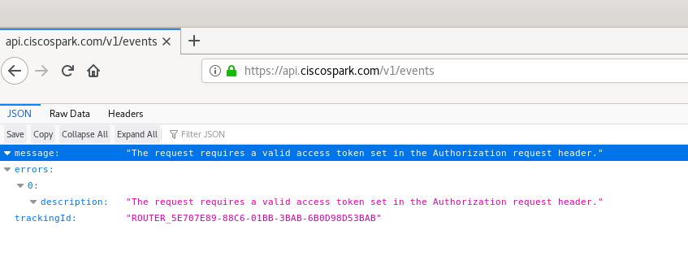
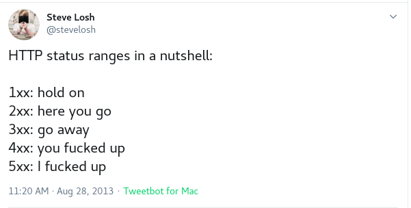

# Interfacing with the Webex API with Python

### This part will specifically cover writing programs to work with an API

### Prerequisites 
- Python 3
    - [Downloads](https://www.python.org/downloads/)
- Python 3 Requests library
    - [Requests](https://pypi.org/project/requests/)
- Cisco/Webex profile
- Text editor with Python 3 syntax highlighting
    - [Sublime 3](https://www.sublimetext.com/3)
    - [Visual Studio Code](https://code.visualstudio.com/Download)
    - [Notepad ++](https://notepad-plus-plus.org/downloads/)

**The resulting code this part covers can be found [here](https://github.com/shailpatels/WebExCLI/blob/master/webex.py)**


Before we can interact with the Webex API, we need an authentication token (also called auth token for short).
This is like our program's password similar to any password you use when you
log into a website. You should **never** give away your auth token or release code containing it, this
is effectively handing out your Cisco password to someone.

## You personal auth token

First log into Cisco [DevNet](https://developer.cisco.com/) with either a Teams account or a Cisco account.

Then go to [Getting Started](https://developer.webex.com/docs/api/getting-started) and scroll down to **Your personal access token** which will be valid for 12 hours. You can press the copy button and save the string to
a file somewhere. 

You're ready to start making requests!
In fact you can send one now without writing any code, since requests are sent over HTTP you can start copying 
API endpoints from the "API reference" into a browser URL bar.

Here is my response from trying a random endpoint : 



Even though I'm logged in with my Cisco account on Devnet, Webex doesn't recognize my request because REST is 
stateless. All the information required to perform the operation in a request must be sent with it. In this case
its clear from the error message I need to send my authentication token in order to get a "good" response from Webex.

## First python program

Our first attempt at interfacing with the Webex API will be pretty much the same thing we did with the browser to
see the response in detail. Lets make sure our we can import the required library : requests.


Here is my entire program so far in a file I named "webex.py".

*Note: I'm using Linux for my OS, you may have to use python instead of python3*

```python
import requests

print("Hello World!")
```

and my output:

```console
shail@debian:~/webEx/src$ python3 webex.py 
Hello World!
shail@debian:~/webEx/src$ 

```

If you see "Hello World!" and no errors, you have the requests library installed correctly! Requests is a python library that will allow us to send HTTP requests without having to get into socket programming. The documentation 
for the library can be found [here](https://requests.readthedocs.io/en/master/).

We'll be trying the same endpoint as before `https://api.ciscospark.com/v1/events` and we'll be using 
the `get` function from the imported library.

```python
import requests


response = requests.get( "https://api.ciscospark.com/v1/events" )
print(response) 

```

```console
shail@debian:~/webEx/src$ python3 webex.py 
<Response [401]>
shail@debian:~/webEx/src$ 

```

Instead of a JSON object getting printed we're getting a status code, this is the default behavior when a 
Python requests object is sent to the `print` function. Notice the code is "401" which represents "Unauthorized"
Here are some common codes:

|Code|Meaning|
|----|-----|
|200 | OK - the request succeeded |
|400 | Bad request - server couldn't understand the request|
|401 | Unauthorized - you haven't authenticated with the server yet|
|403 | Forbidden - you don't have permission |
|404 | Not Found - server cannot find the given resource |
|405 | Method not allowed, some servers can restrict newer methods like DELETE|
|500 | Internal Server error |

There are many more status codes but these are some common ones you'll probably see.
A full list can be found [here](https://developer.mozilla.org/en-US/docs/Web/HTTP/Status),
Here's a quick way to remember the different types:


In order to read the contents itself we need to access the `text` property of the response object.
By default this will return the decoded response and will assume the server is using UTF-8.

```python
response = requests.get( "https://api.ciscospark.com/v1/events" )
print(response) 
print(response.text)
``` 
will produce:
```console
<Response [401]>
{"message":"The request requires a valid access token set in the Authorization request header.","errors":[{"description":"The request requires a valid access token set in the Authorization request header."}],"trackingId":"ROUTER_5E708612-B906-01BB-2E6D-6B0D98D52E6D"}

```

However keep in mind that text returns a string which isn't helpful to access a JSON object. Luckily JSON can be seamlessly converted to and from a python dictionary. This will allow us to access specific key value pairs.
Here is a basic error message handler:

```python
import requests

#send a request
response = requests.get( "https://api.ciscospark.com/v1/events" )

#if something went wrong, dump every field, line by line
if (response.status_code != 200):
    json = response.json()

    for key in json:
        print( key, ' ---> ', json[key] )
```

will produce:

```console
shail@debian:~/webEx/src$ python3 webex.py 
message  --->  The request requires a valid access token set in the Authorization request header.
errors  --->  [{'description': 'The request requires a valid access token set in the Authorization request header.'}]
trackingId  --->  ROUTER_5E70879F-BE64-01BB-2771-6B0D98D52771

```

Now we'll add code to send our Auth token. However sometimes our token might be longer than the maximum URL length, an additional place we can store information is in an HTTP header. There are different types of headers 
for different purposes, one of them is designed for Authentication. The Authorization variable in the Auth
header is used for authentication with a server.

In order to manually set a header in the requests library we give the optional parameter "headers" a dictionary
containing the specific key value pairs we want to set. This optional parameter is part of the get function we 
used earlier. We'll also store the auth token we got from devnet earlier as a variable.

I've also changed the target URL to an endpoint that will return information about ourselfs 

```python
import requests

MY_KEY = "YOUR_AUTH_TOKEN_HERE"
ENDPOINT = "https://api.ciscospark.com/v1/people/me"
#send a request
response = requests.get( ENDPOINT, headers = {"Authorization" : "Bearer " + MY_KEY} )

#if something went wrong, dump every field, line by line
if (response.status_code != 200):
    json = response.json()

    for key in json:
        print( key, ' ---> ', json[key] )

else:
    print( "Got response of ", response.status_code, " from Webex!" )
    json = response.json()

    for key in json:
        print( key, ' ---> ', json[key])


```
*Note: The Webex API requires you to place the string "Bearer " before your API key in a request*

This will return information about myself!

```console
Got response of  200  from Webex!
id  --->  Y2lzY29zcGFyazovL3VzL1BFT1BMRS85MGM2NDNiNC0yNDFjLTQwMzItYjIwYy03OTE2ZDNmNTA3MWM
emails  --->  ['shailpa@cisco.com']
phoneNumbers  --->  [{'type': 'work', 'value': '+1 984 216 2043'}]
displayName  --->  Shail Patel
nickName  --->  Shail
firstName  --->  Shail
lastName  --->  Patel
avatar  --->  https://avatar-prod-us-east-2.webexcontent.com/Avtr~V1~1eb65fdf-9643-417f-9974-ad72cae0e10f/V1~90c643b4-241c-4032-b20c-7916d3f5071c~76191fef05154820bc4fad861cedcf67~1600
orgId  --->  Y2lzY29zcGFyazovL3VzL09SR0FOSVpBVElPTi8xZWI2NWZkZi05NjQzLTQxN2YtOTk3NC1hZDcyY2FlMGUxMGY
created  --->  2019-10-29T22:19:51.386Z
lastActivity  --->  2020-03-17T03:04:47.643Z
status  --->  inactive
type  --->  person

```

## Building an example Webex Client

The following will show how to build a terminal based client for webex. The commands 
will be based loosely on some linux terminal commands.

### Setting up infrastructure 

The design will be a main loop that will keep asking the user for a new command. We'll
start organizing our code within functions and write the skeleton for our main loop.

```python

import requests

MY_KEY = "YOUR_AUTH_TOKEN_HERE"


def showHelp():
    print("ls - list spaces")
    print("cd - change space")
    print("msg <MSG> - send a message to a space")
    print("whoami - gets information on yourself")
    print("whois <ID> - gets information on someone else")
    print("@q - exit the program")


def main():
    while (True):
        #get the user input
        cmd = input("Enter a command, or type \"help\" for help\n")

        #remove trailing and leading whitespace and change to lowercase
        cmd = cmd.strip().lower()

        if (cmd == "help"):
            showHelp()
        elif (cmd == "@q"):
            break
        elif (cmd == "whois"):
            pass
        elif (cmd == "whoami"):
            pass
        elif(cmd == "msg"):
            pass
        elif(cmd == "ls"):
            pass
        elif(cmd == "cd"):
            pass
        else:
            print("Unknown command \"" + cmd + "\"" )

main()
```

We'll need to write functions to handle each command that will interact with the Webex API but each of 
each of these functions will need to send a request. We could use the `get` function over and over again
but it would make sense to make a dedicated function to send out a request. This way we can check for errors
in the same location. 

*All of the functions will be above "def main" from this point on*

```python
'''
The handleResponse function takes a URL and an optional payload parameter and 
makes a request to the target. It will use whatever MY_KEY is set to for autherization

endpoint : a string representing a URL to send the request to
payload : a dictionary of variables to send to the target on the URL

returns True on success along with a response object
return False on failure with a None object
'''
def handleResponse(endpoint, payload = {}):
    response = requests.get(endpoint, headers={"Authorization" : "Bearer " + MY_KEY}, params=payload )

    if ( response.status_code != 200):
        print("Something went wrong! Got an error code of :", response.status_code)
        json = response.json()

        print ("Message ", json["message"] )
        print ("Here are the errors I got:")
        for error in json["errors"]:
            print("\t")
            for key in error:
                print(error[key])


        return False, None
    else:
        return True, response

``` 

Now whenever we want to send a request to an endpoint all we have to do is call
the function. If we want to send any additional variables we can populate the optional `payload`
variable with data.

```python
handleResponse("MY_ENDPOINT")
```

and the rest is handled for us, now every time we send a request we can make sure error messages
are being handled correctly and properlly displayed to the user. In fact the majority of the function
is pretty printing error messages. Here is an overview of the function
	- First check if the status represents a good response or not
	- If it does return True and the response object
	- Otherwise print out the status code we did get
	- Print the top level message from Webex
	- Go through the list of error message and print each dictionary
	- Finally return False which lets the calling function know something went wrong and return a None object

### whoami

Our `whoami` function then has to call the `handleResponse` function and check that everything 
went right with our first return value and then print the data back to the user in a nice format.

```python
def whoAmI():
    status, response = handleResponse("https://api.ciscospark.com/v1/people/me" )
    if status == True:
        json = response.json()
        #pretty print the users information
        print("Hi ", json["displayName"], "!" )
        print("Your email(s) are : ")
        for x in json["emails"]:
            print(x)

        
        print("Take a look at your profile pic at : ")
        print(json["avatar"])
        print()
```

Remember we to call the actual function once the user types the whoami command!
```python
elif (cmd == "whoami"):
    whoAmI()
```


### whois <ID>

The whos is command will be more complicated since we'll have to ask the user for the 
person they want to search. Lets look at the API details on devnet:

>Get Person Details
>Shows details for a person, by ID.
>
Response properties associated with a user's presence status, such as status or lastActivity, will only be displayed for people within your organization or an organization you manage. Presence information will not be shown if the authenticated user has disabled status sharing.
>
Specify the person ID in the personId parameter in the URI.
>
GET
/v1/people/{personId}

*from https://developer.webex.com/docs/api/v1/people/get-person-details*

But wait, remember the person ID isn't a persons CEC or displayname, its the massive string used in Webex's database to keep track of people, for example my user ID is "Y2lzY29zcGFyazovL3VzL1BFT1BMRS85MGM2NDNiNC0yNDFjLTQwMzItYjIwYy03OTE2ZDNmNTA3MWM". We can't expect humans 
to memorize a string this long for everyone they want to search so instead we need to convert a human
readable name to a user id which we can then perform a lookup on.

Luckily there is a separate API endpoint that takes either a display name or an email and performs 
a lookups

>List People
List people in your organization. For most users, either the email or displayName parameter is required. Admin users can omit these fields and list all users in their organization.
>
Response properties associated with a user's presence status, such as status or lastActivity, will only be displayed for people within your organization or an organization you manage. Presence information will not be shown if the authenticated user has disabled status sharing.
>
Long result sets will be split into pages.
>
GET
/v1/people

*from https://developer.webex.com/docs/api/v1/people/list-people*

For now we'll focus on using display names only, so step one is to make a helper function

```python
'''
Attempts to find a user ID from a given username
If none are found returns False, ""
otherwise returns True, {ID}
'''
def searchIdFromUsername(username):
    status, response = handleResponse("https://api.ciscospark.com/v1/people", {"displayName" :  username})
    if ( status == True):
        # lets see if we found anyone
        json = response.json()
        people = json["items"]

        if len(people) < 1:
            return False, ""
        else:
            return True, people[0]

    else:
        return False, ""
```

This will give us a userID from a displayname, if one exists. We can then use that to get the 
persons information with the following function.


```python
'''
Given a username tries to find that person's information
'''
def whoIs(tgt):
    status, response = searchIdFromUsername( tgt )
    if status == False:
        print("Failed to lookup ", tgt )
        return


    user_id = response["id"]
    #we have the user_id now perform a look up on it
    #append the user_id to the url since each person is an endpoint
    status, response = handleResponse("https://api.ciscospark.com/v1/people/" + user_id )
    if status == False:
        print("Failed to lookup ", user_id)

    else:
        #pretty print data
        json = response.json()
        print()
        print("This is what I know about \"" + tgt + "\"")
        print("Goes by : " + json["displayName"] )
        print("Their emails are: ")

        for x in json["emails"]:
            print(x)

        print()
        print("Their avatar is: ")
        print(json["avatar"])
        print()
        print("Right now they're ", json["status"], " and were last online ", json["lastActivity"]  )
        print()

```

The main loop was updated as well to get the extra information needed:

```python
	elif (cmd == "whois"):
   		tgt = input("Enter a person to search\n")
        whoIs(tgt)
```

You might of noticed that the first person does actually return the exact information we want to find out
but instead of a single person it returns multiple. The second API request was actually unnecessary but
this was done to show how to have one request depend off of another.

### ls 

The `ls` command will list available spaces to move too. Since this is a terminal app, we'll pretend 
the user can only be in one space at a time. If the user wants to change to a different space to 
send a message, they'll have to use the `cd` command.

The implementation is simple, and I've added a global variable `current_room` to keep track where
the user is (although this isn't a real thing since you can jump into any room at any time)

```python
current_room = None
def Ls():
    status, response = handleResponse("https://api.ciscospark.com/v1/rooms")
    if ( status ):
        json = response.json()
        rooms = json["items"]

        for i in range( len(rooms) ):
            print(i, " : ", rooms[i]['title'] )

        print("You are apart of ", len(rooms), " rooms")
        print()
```

### cd

The `cd` command will take either a number, representing an index to change rooms into or a title of 
the room to enter.


```python
'''
given a target room attempt to change to it
'''
def Cd(tgt):
    #is it a number or string 
    status, response = handleResponse("https://api.ciscospark.com/v1/rooms")
    if ( status ):
        json = response.json()
        rooms = json["items"]
    else:
        return 


    is_number = tgt.isnumeric()
    global current_room

    for i in range( len (rooms) ):
        if (is_number and int(tgt) == i ):
            current_room = rooms[i]
            break
        elif( rooms[i]['title'] == tgt ):
            current_room = rooms[i]
            break

    print("Current room is ", current_room['title'])
```

### msg command

The message command will send a given message to the current room the user is in.
Notice this is the first request to use a POST request. 
The headers dictionary is still the same, but now we send additional data in a second
dictionary that will get stored in the HTTP body. 

```python

'''
Sends a given message to the current room
'''
def sendMsg(msg):
    global current_room
    curr_id = current_room["id"]
    response = requests.post("https://api.ciscospark.com/v1/messages", 
                             headers={"Authorization" : "Bearer " + MY_KEY},
                             data={"roomId" : curr_id, "text" : msg})

    if response.status_code == 200:
        print("Sent message to ", current_room, "!!")
    else :
        print("ERROR ", response.status_code)

```

Remember the message you give will be sent to whatever room the program currently has in the `current_room` var,
and will look like you sent it!

The entire program can be found on [Github](https://github.com/shailpatels/WebExCLI/blob/master/webex.py)

Back to [Page 1](index.md)