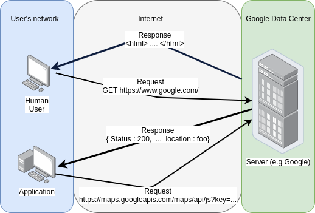

# Using the Webex API & building bots with Python

This guide will cover writing scripts to interact with Webex teams and then creating a webEx bot.
It will also go over common web programming concepts such as JSON, RESTful APIs, and making web requests.


**Structure**
- The first page will go over background information
- APIs, JSON, and REST will be gone over in detail
- Programming using the Webex API will be on [Page 2](api.md)
- Page 3 Building a bot is coming soon!

### What is an API and why do I care?


API stands for *Application programming interface* which is a way of allowing one or more
programs talk to each other. 
For example, your text editor needs to talk to your operating
system in order to read & write files. A webAPI allows your program to access databases and
services provided online like Webex.

The biggest advantage of an API is reducing the amount of code you need to write, the [Stripe
API](https://stripe.com/docs/api) allows you to integrate credit card processing into your 
app with a few lines of code, whereas previously you would need a dedicated engineering & finance team.

We'll be focusing on Web APIs to fetch data from a server, modern web APIs use HTTP (HyperText Transfer Protocol) to communicate.
You can think of an API as an automated method to browse the web for now. When you use Google Search,
you're sending a web request over HTTPS to a server to fetch the specific results you want. An API 
works a similar way where URLs are used to send requests. For humans, servers will send back HTML, which
the browser will render into a website, for APIs, the server will send back JSON - which I'll cover later in depth
but you can think of as raw data for now.

*Oversimplified requests and responses:*
<p align="center">

</p>

Note: A server can give a human JSON and an API an HTML webpage, or nothing at all. However, well designed 
APIs have documented responses that are typically standardized around JSON. A good application is also
designed to handle unexpected responses from a server.

### What is JSON and why are APIs sending it to my app?

JSON stands for JavaScript Object Notation, it was originally designed as a method to describe objects in 
the programming language JavaScript but has recently been used as a format to encode data. When we say 
data is encoded in JSON format, we mean its formatted to the JSON standard, all JSON is plain text and human readable.

JSON is in fact both human and machine readable, allowing computers to quickly generate and parse JSON while
also being able to be understood for humans.

Image for example you wanted to create a program that would send information about Cisco switches running in
a network. Here's the information we'd like to know:
    
-   Is the device a switch or router?
-   What interfaces are up
-   What model is the device

Now lets say a software engineer has written the script to collect the information and its our job to package it
up in an API we're developing. The easiest way would be to just send everything as plain text as a response but this would obviously be a mess to parse on the receiving end.

*Hard for computers to read:*

> switch = true up interfaces: G0/0,G0/1,G0/2 model = C3560 ...

#### Example 1

Although a human could make sense of this it would be difficult for a computer,
where do information fields start and end?

JSON attempts to solve this problem by describing **names** with **values**.
Here is the above data encoded as JSON:

```json
{
    "switch" : true,
    "up_interfaces" : ["G0/0", "G0/1", "G0/2"],
    "model" : "C3560"
}
```

#### Example 2

Notice that the format is still human readable (for the most part). Some additional syntax has been added to assist the computer such as curly brackets : `{}` to indicate the start and stop of name value pairs, `[]` to
indicate lists. Notice that all the fields are listed as strings by the quotes, except for the boolean type.
Each line is also comma separated.

Now lets add additional devices to our network and see what the reflected JSON might look like.

```json
{
    "switches" : [
        {
            "model" : "C3560",
            "up_interfaces" : ["G0/0", "G0/1", "G0/2"]
        },
        {
            "model" : "C3560",
            "up_interfaces" : ["G0/0"]
        }
    ],
    "routers" :[
        {
            "model" : "ASR 9000",
            "up_interfaces" : ["Te2/0/0", "Te2/0/1"]
        }
    ]   
}
```  

#### Example 3

This example we've added two top level lists, one for `switches` and the other for `routers`. Notice 
that every member in each list is a name/value pair. We can embed as many name/value pairs or lists within each
other and vice versa. Although this is a simplified example, we have all the tools to model real world objects.
We could model an individual interface with the following JSON:

This JSON object can easily be placed into our second example above instead of listing 
interfaces by their name and would give us more detail about our devices.

```JSON
{
    "interface_name" : "FastEthernet0/1",
    "status" : "down",
    "duplex" : "full",
    "speed" : "auto",
    "in/out" : {
        "input_packets" : 956,
        "output_packets" : 0,
        "in_queue" : 0 
    }
}
```

#### A real NXOS API response & request 

Although we created a fake example, compare the above JSON blocks to a snippet of an actual API response from a 
NXOS device with an API request of "show cdp neighbors":


```json
"ROW_cdp_neighbor_brief_info" : [
    {
        "capability": [
            "switch", 
            "IGMP_cnd_filtering"
        ], 
        "device_id": "sjc19-121-b20-switch", 
        "ifindex": 83886080, 
        "intf_id": "mgmt0", 
        "platform_id": "cisco WS-C3560X-48", 
        "port_id": "GigabitEthernet0/48", 
        "ttl": 173
    }, 
    {
        "capability": [
            "router", 
            "switch", 
            "IGMP_cnd_filtering", 
            "Supports-STP-Dispute"
        ], 
        "device_id": "macsec1.insieme.local(FGE20310KM0)", 
        "ifindex": 436212224, 
        "intf_id": "Ethernet1/10", 
        "platform_id": "N9K-C9508", 
        "port_id": "Ethernet1/10", 
        "ttl": 123
    }
]
```

The above JSON is the API response, the NXOS API also expects the request to have its values encoded 
in JSON as well:

```json
{
  "ins_api":{
  "version": "1.0",
  "type": "cli_show",
  "chunk": "0",
  "sid": "1",
  "input": "show cdp neighbors",
  "output_format": "json"
}
```

The above parameters could be tweeked be the end user to get relevant information, for example the API can
be used to construct a Web-UI instead of using a terminal to interact with NXOS devices.


JSON names must be a string, a value can also be a string or any of the following types:

|Type| Example|
|--|--|
|String| "I'm a string!" |
|Number| 27 |
|Object| \{"JSON" : "Yay"\}|
|Array | [ "lists!", "fun", "two" ]|
|Boolean| True |
|Null| null |

### Whats a request and a response?
I've been using the terms request as something a client asks a server over the web, and 
a response as what the server will send back. In our use case a client will be the 
programs we write, but they're typically web clients like browsers. 

A request is sent over HTTP by an application. There are different types of requests depending 
on what operation needs to be done between a client & server. 


| Request Type | Operation |
|--------------|-----------|
| GET | Used to retrieve data and should have no other effect|
|POST | Used to send data and to create/update the server |
|PUT  | Used to send data and to create/update the server*|
|DELETE| Deletes a given resource on the server |

*\*The PUT request is considered idempotent i.e. will always produce the same result regardless of how many times its called. For example, a POST request to create a new user in a server with the username aphacker may
only be allowed once if usernames are unique.*

Since requests are sent over HTTP, all the information is encoded in a URL, you're probably most used to 
sending requests through a web browser.

Lets say you wanted to visit youtube, this would be a GET request and would look like:
```
GET https://www.youtube.com/
```

What if you wanted a specific video from youtube, this would still be a GET request but you would need to pass in
additional information, such as the video you want. HTTP allows names and values to be sent after the address path (after the question mark):

```
https://www.youtube.com/watch?=My_video_ID
```

Additional variable can be places by separating them with an amperstamp

```
https://www.example.com/my_path/my_file/?var1=shail&var2=koalas&var3=cisco
``` 

POST requests are when you want to do more than retrieve data, this could be uploading or changing 
a file stored on a server, or filling out a form. A POST request can look the same as a GET request 
in terms of the URL, but the request has some additional headers and the bulk of the user data is 
stored in the HTTP request body.

Here's how the URL might look:
```
https://www.phoneco.com/lookup
```

But the actual request itself will be representation differently,
```
POST /lookup HTTP/1.1
HOST: www.phoneco.com
Content-Type: application/json
Content-Length: 29

{"name":"foo","number":"123"}
```

Notice that the data we want to send to the server isn't in the URL but within the body and is 
encoded in JSON format.

### What is a RESTful API?

**REST stands for REpresentational State Transfer**

*Fun Fact:, REST was designed by Roy Thomas Fielding, creator of HTTP and confounded the Apache Server project, 
which runs close to ~40% of internet servers. You can read his original design [HERE](https://www.ics.uci.edu/~fielding/pubs/dissertation/fielding_dissertation.pdf)* 

Its a software design for web style be creating a standard set of operations between systems.
In order for an API to be considered RESTful, it must have the following properties:

-   Client Server Architecture : The user interface (a UI, webpage, or terminal) is separated from the server. This allows the server side to scale faster by focusing on server components only and allows the client to evolve rapidly by abstracting the server side away.

-   Stateless : No context is ever stored and no one request should affect another.

- Cacheable : clients and other devices throughout the world wide web can cache requests, as a result
indicating if a request is ok to be cached or not is required. For example resources that don't change such as a
site's landing page versus content that constantly changes like Facebook posts.

- Layered System : A client cannot tell if it is directly connected to an end system or not, for example a proxy between the server and client won't affect the system.

- Uniform Interface :
    - A request must identify its encoding as either HTML, XML, or JSON
    - If a client holds a representation of a resource (like a file) it must hold enough information to be able to modify or delete it on the server
    - Each message should describe how to process itself to the server
    - A client can use server provided links to access all the resources it needs


The above lists the technical details of RESTful apis, but overall you can think of REST as a description
of how an API should be designed and implemented. As developers we're concerned with what method to use (POST, GET, etc), the data we send, and where we send it. It is up to the server to authenticate our request and 
respond. 

[API Programming](api.md) 